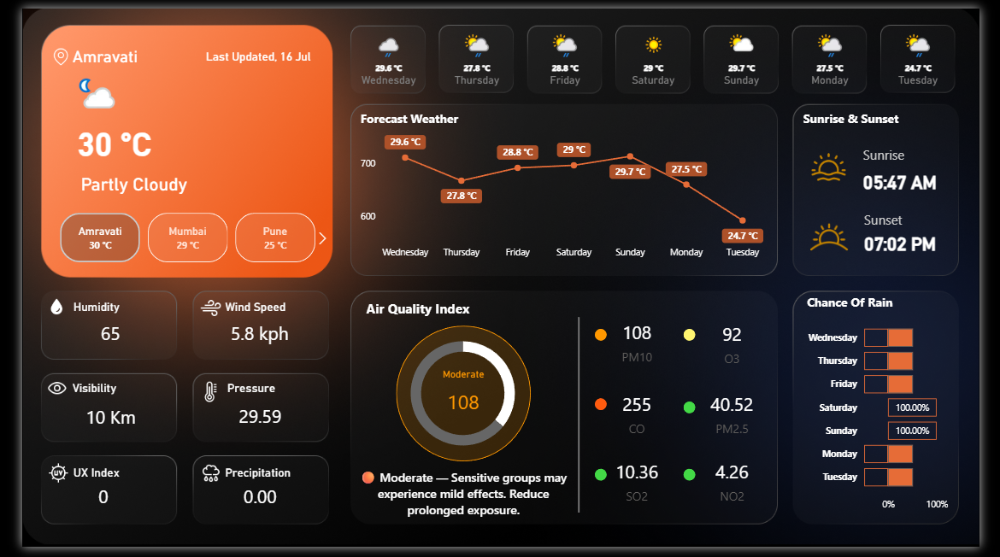

# 🌦️ Real-Time Weather Forecast Dashboard – Power BI

This is a fully dynamic Power BI dashboard project that fetches **real-time weather data** from a public API and visualizes current conditions, forecasts, and air quality metrics.

## 📌 Features:
- Real-time API integration via Web Connector
- 7-day weather forecast
- Live AQI and health insights (emoji-coded)
- Sunrise/sunset visuals
- Fully responsive dark-themed dashboard

## 🛠️ Tools Used:
- Power BI Desktop
- OpenWeatherMap API / Weather API
- DAX for logic and visualization
- JSON + Power Query for data cleaning

## 📸 Preview:

## 📁 File:
- `Weather_Dashboard.pbix` – Power BI project file

## 💡 Author:
[Pranit Patil](https://www.linkedin.com/in/pranit-patil-990b01181)

---

Let’s connect on LinkedIn or feel free to fork this repo!
